Lab Meeting
========================================================
author: Meridith L. Bartley 

Data Summary
========================================================
- two hours of observations
- high density (1 chamber) & low density (4 chambers)
- 60 ants interacting 
- 232 interactions in high density
  - 10 with queen
- 288 interactions in low density
  - 17 with queen

Interactions Per Ant
========================================================
$\\$

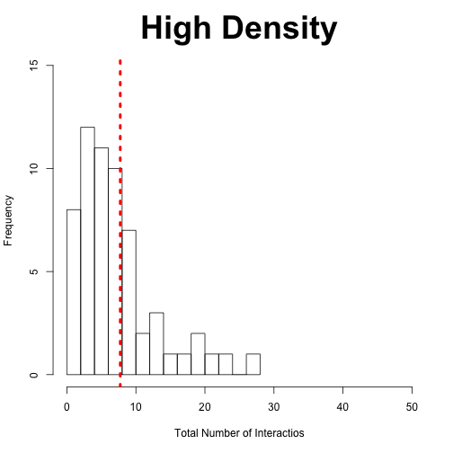
- 60 individuals in each

***

$\\$

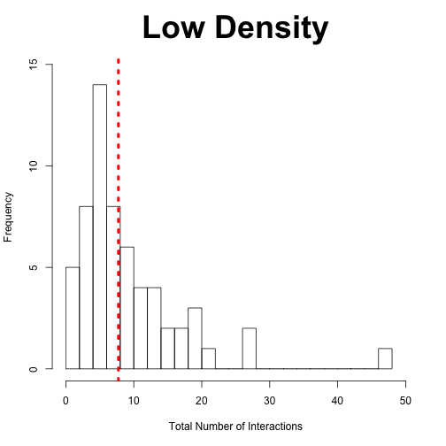

Interactions per Ant by Location
========================================================
$\\$

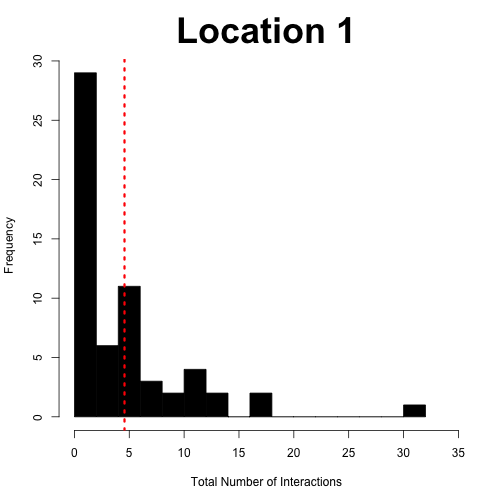
- 37 and 32 individuals

***
$\\$

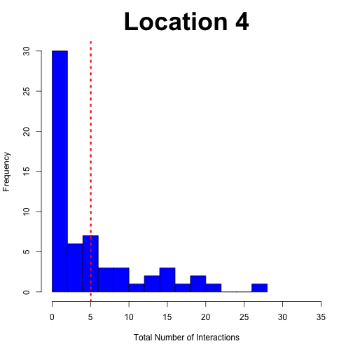

Total Interactions over Time
========================================================
$\\$

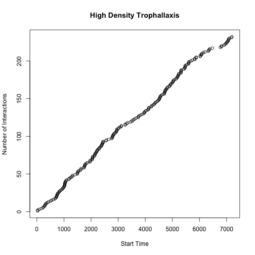

***

$\\$

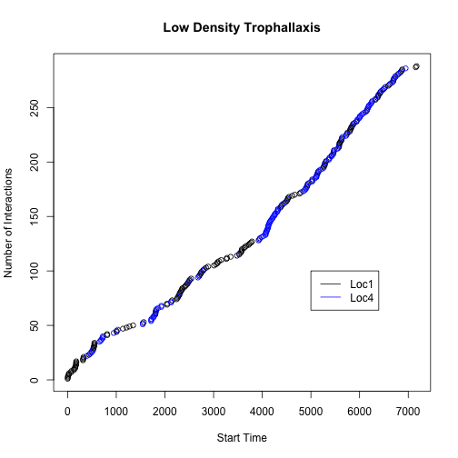

Low Density Interactions by Location
========================================================
$\\$

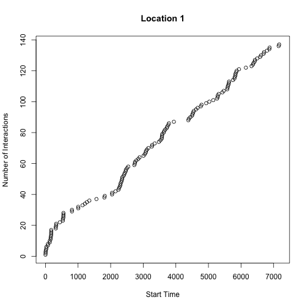

***
$\\$

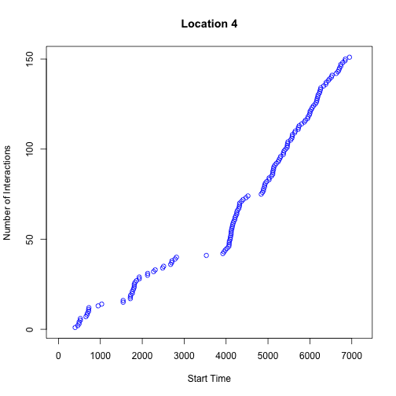

Model for Interactions
========================================================

Observed Interactions: $\text{ N}_t \sim \text{Pois}(\lambda_{X_t})$

  Unobserved States: $\text{ X}_t | \text{ X}_{t-1} \sim \text{Multinom} (1, \underline{p}_{X_{t-1}})$

  where, 
  
  $$\mathbf{P} = \begin{bmatrix} p_{ 11 } & \dots  & p_{ 1n } \\ \vdots  & \ddots  & \vdots  \\ p_{ n1 } & \dots  & p_{ nn } \end{bmatrix}$$
    
$\lambda_{X_t} \sim \text{Gamma}(\alpha, \beta)$

$\underline{p}_{X_t} \sim \text{Dirichlet}(\underline{\theta})$

    
    
MCMC - High Density
========================================================

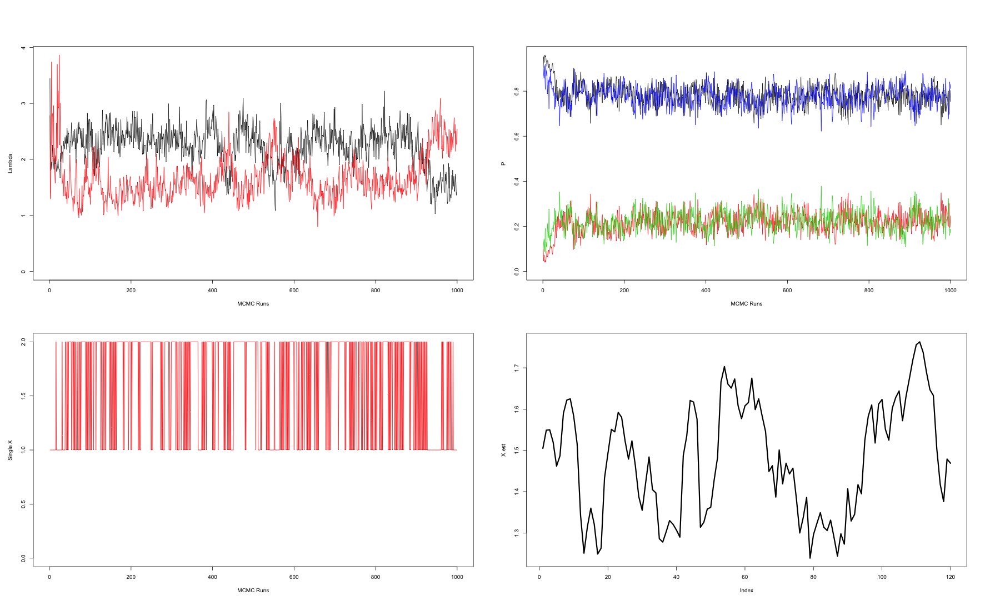

2 State Model - High Density
=========================================================

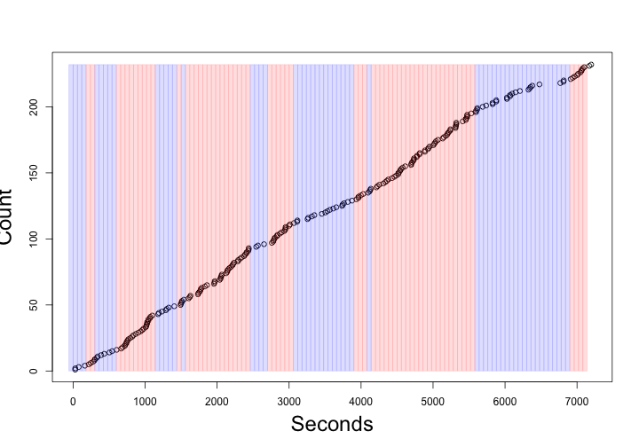

MCMC - Low Density
========================================================

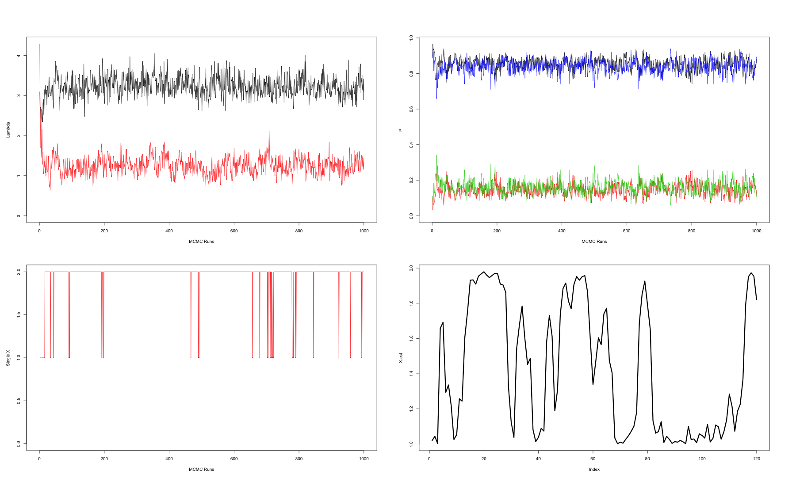

2 State Model - Low Density
=========================================================

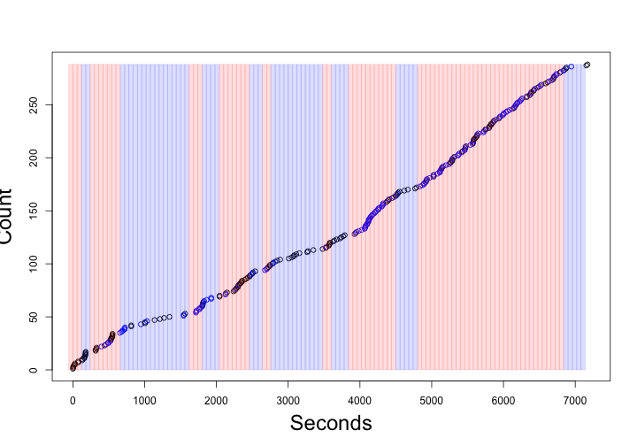

MCMC - Low Density Location 1
========================================================

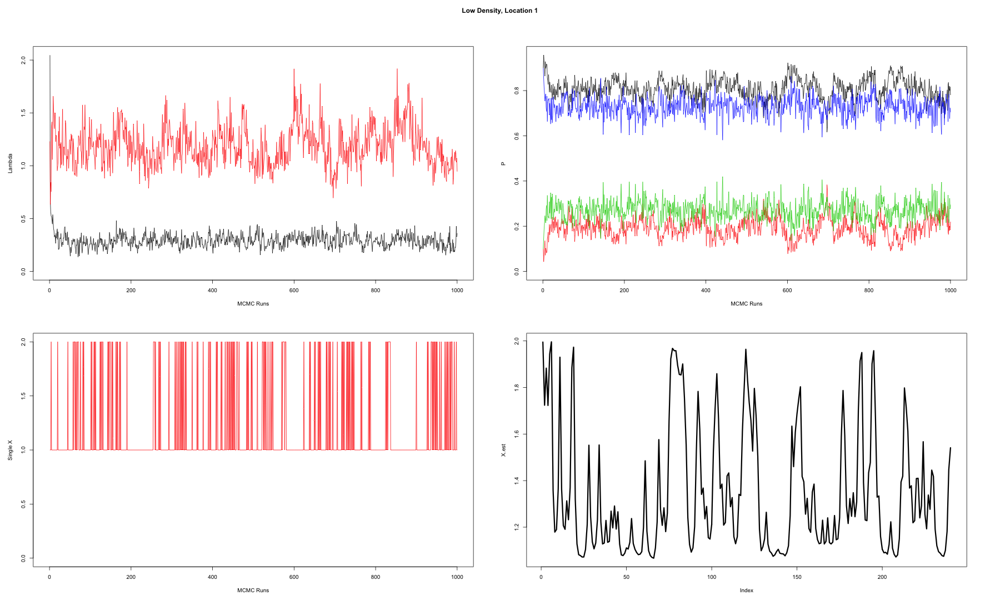

2 State Model - Low Density Location 1
=========================================================

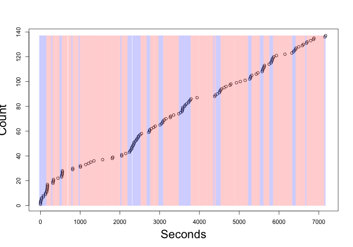

MCMC - Low Density Location 4
========================================================

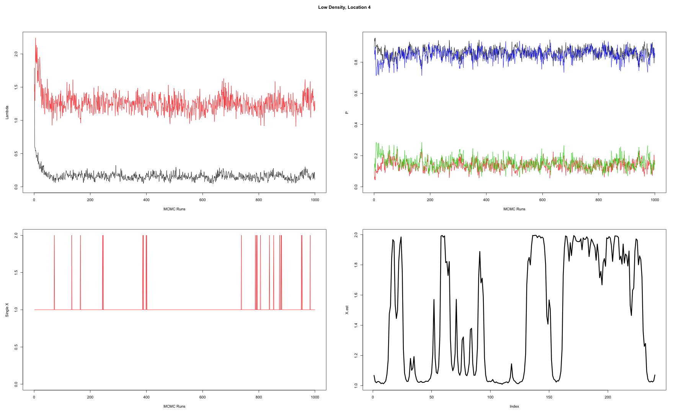

2 State Model - Low Density Location 4
=========================================================

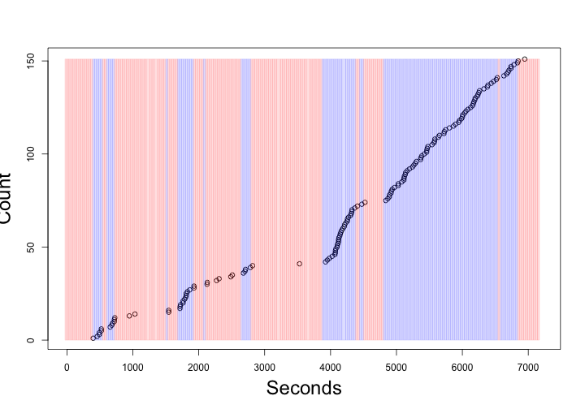
