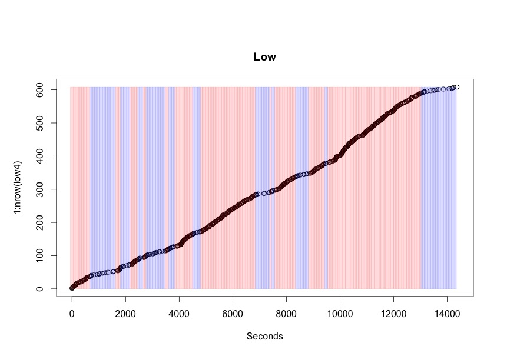

Joint Lab Meeting 
========================================================
author: Meridith L. Bartley
date: 4 April, 2016

2 Hr High Density with Forager Arrivals
========================================================

2 Hr Low Density with Forager Arrivals
========================================================

Low Density Split Locations with Forager Arrivals
========================================================

MCMC with Forager Arrivals
========================================================

MCMC with Forager Arrivals
========================================================

Now with Forager Arrivals
========================================================

Now with Forager Arrivals
========================================================

4 Hour Data
========================================================

4 Hour Data
========================================================

4 Hour Data
========================================================

4 Hour Data
========================================================

